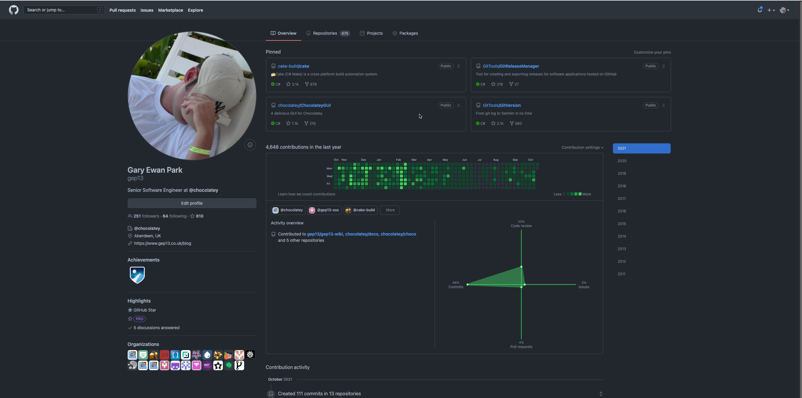

@title[Getting Started with OSS]

[drag=100 25, drop=center, set=h1-blue h3-blue]

## Getting Started with OSS
### A Beginners Guide

---

@title[Who is this guy?!?]

## Who is this guy?!?

---

## @gep13

---

@title[My Contributions]

[drag=100 15, drop=top]
## My Contributions...

@ul[drag=100, fit=1.5, list-spaced-sm-bullets]
* Joined GitHub in 2011
* Over 24000 contributions
* Member of 23 Organisations
* Responsible for [42 NuGet packages](https://www.nuget.org/profiles/gep13)
* Responsible for [30 Chocolatey packages](https://community.chocolatey.org/profiles/gep13)
@ul

---

@title[None of that is important]

## None of that is important

---

@title[Anyone can contribute to OSS]

## Anyone can contribute to OSS

---

@title[What is OSS]

## What is OSS?

@fa[quote-left] Open source software is software with source code that anyone can inspect, modify, and enhance

@size[12px](Taken from https://opensource.com/resources/what-open-source)

---

@title[Common examples...]

[drag=100 15, drop=top]
## Common Examples...

@ul[drag=100, fit=1.5, list-spaced-sm-bullets]
* Linux
* OpenOffice
* MySQL
* Firefox
* VS Code
@ul

---

@title[Why should I care?]

[drag=100 15, drop=top]

## Why should I care?

@ul[drag=100, fit=1.5, list-spaced-sm-bullets]
* It is great fun!
* You will work with some amazing people
* You will become a better developer
* Free stuff!
@ul

---

@title[Making your first contribution]

## Making your first contribution

---

@title[STOP!]

# STOP!

---

@title[Learn Git]

## Learn Git

* https://git-scm.com/doc
* https://dangitgit.com/en
* https://cbx33.github.io/gitt/
* https://www.youtube.com/watch?v=3m7BgIvC-uQ

---

@title[Find a project you like]
## Find a project you like

---

@title[Read the Contribution Guidelines]

## Read the Contribution Guidelines

---

@title[Are you allowed to contribute?]

## Are you allowed to contribute?

* Read the license agreement
* Sign the CLA

---

@title[Create an issue first]
## Create an issue first

---

@title[Make a Pull Request]

## Make a Pull Request

* [Example](https://github.com/chocolatey/choco/pull/2390)

---

@title[Be Patient]

## Be Patient

* [Example](https://github.com/chocolatey-archive/chocolatey/pull/238)

---

@title[Don't be a jerk!]

## Don't be a jerk!!

---

@title[Starting your own OSS Project]

## Starting your own OSS Project

---

@title[DO IT!]

## DO IT!

---

@title[Pick a license]

## Pick a license

* [choosealicense.com](https://choosealicense.com/)

---

@title[Create a good README]

## Create a good README

* [First Example](https://github.com/cake-build/cake/blob/develop/README.md)
* [Second Example](https://github.com/chocolatey/choco/blob/master/README.md)

---

@title[Contribution Guidelines]

## Contribution Guidelines

* [Example](https://cakebuild.net/community/contributing/contribution-guidelines)

---

@title[Contributor Code of Conduct]

## Contributor Code of Conduct

* [Example](https://www.contributor-covenant.org/)

---

@title[Contributor License Agreement]

## Contributor License Agreement

* [Example](https://cla.dotnetfoundation.org/cake-build/cake)
* [In Action](https://github.com/cake-build/cake/pull/2574)
* [CLA assistant](https://cla-assistant.io/)

---

@title[Issue and Pull Request Templates]

## Issue and Pull Request Templates

* [First Example](https://github.com/cake-build/cake/issues/new/choose)
* [Second Example](https://github.com/chocolatey/choco/issues/new/choose)

---

@title[Continuous Integration]

## Continuous Integration

* [Example](https://github.com/cake-build/cake/blob/develop/README.md#continuous-integration)

---

@title[Encourage Community and find a team]

## Encourage Community and find a team

---

@title[Be Patient]

## Be Patient

---

@title[Don't be a jerk!!]

## Don't be a jerk!!

---

@title[Ways to contribute]

## Ways to contribute

* [Hacktoberfest](https://hacktoberfest.digitalocean.com/)
* [24 Pull Requests](https://24pullrequests.com/)
* [Up-For-Grabs](https://up-for-grabs.net/#/)
* [CodeTriage](https://www.codetriage.com/)
* [First Timers Only](https://www.firsttimersonly.com/)

---

@title[Questions]

## Questions?

Feel free to get in touch

Email: gep13@gep13.co.uk

Twitter: @gep13

Web: https://www.gep13.co.uk

---

@title[Resources]

## Resources

* Being a good open source citizen
  * https://hackernoon.com/being-a-good-open-source-citizen-9060d0ab9732
* First Timers Only
  * https://www.firsttimersonly.com/
* How to contribute to Open Source
  * https://opensource.guide/how-to-contribute/
